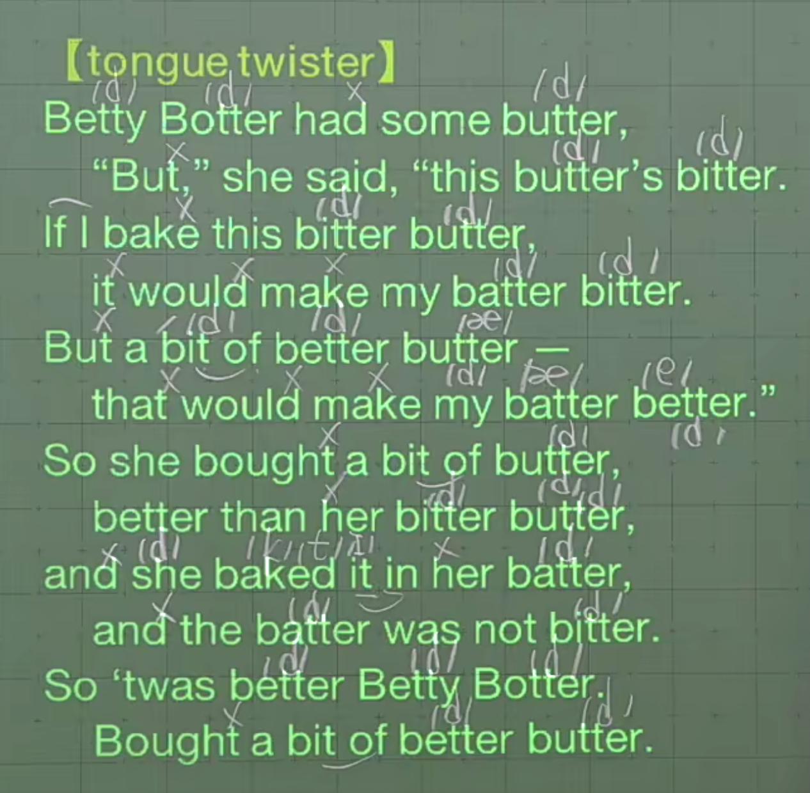

# T 的发言

## 1. t 在词首，或在重音节

发原音标 /t/，无变化

| 例句 | 变化前音标 | 变化后音标 |
| :-- | :-------- | :-------- |
| time | /taɪm/ | /taɪm/ |
| telephone | /ˈtelɪfoʊn/ | /ˈtelɪfoʊn/ |
| control | /kənˈtroʊl/ | /kənˈtroʊl/ |
| street | /striːt/ | /striːt/ |

## 2. t 在词（或句）中，且不在重音节

> 如果 t 在句中词尾，且后面单词首字母为元音，满足连读条件，同样适用该情况。如：How about it.

发清辅音 /t/ 对应的浊辅音 /d/

| 例句 | 变化前音标 | 变化后音标 |
| :-- | :-------- | :-------- |
| water | /ˈwɔːtər/ | /ˈwɔːdər/ |
| bottle | /ˈbɑːt(ə)l/ | /ˈbɑːd(ə)l/ |
| sweater | /ˈswetər/ | /ˈswedər/ |
| about it | /əˈbaʊt ɪt/ | /əˈbaʊdɪt/ |
| write a book | /raɪt ə bʊk/ | /raɪdə bʊk/ |

## 3. t 在词尾

/t/ -> 削弱音（只保留嘴型，不发出该音，但要小停顿一下）

| 例句 | 变化前音标 | 变化后音标 |
| :-- | :-------- | :-------- |
| We went to that hut. 我们去了那间小屋。 | /wiː went tuː ðæt hʌt/ | /wiː wen~~t~~ tə ðæ~~t~~ hʌ~~t~~/ |
| Put my hat back! 把我的帽子放回去。 | /pʊt maɪ hæt bæk/ | /pʊ~~t~~ maɪ hæ~~t~~ bæk/ |
| She hit the hot hut with her hat. 她带着帽子抵达那炎热的小屋。 | /ʃiː hɪt ðə hɑːt hʌt wɪð hər hæt/ | /ʃiː hɪ~~t~~ ðə hɑː~~t~~ hʌ~~t~~ wɪð ~~h~~ər hæ~~t~~/ |

## 4. ~ten, ~tin, ~tain

/t/ -> 削弱音（只保留嘴型，不发出该音，但要小停顿一下）

| 例词/例句 | 变化前音标 | 变化后音标 |
| :------- | :-------- | :-------- |
| mountain 山，山岳 | /ˈmaʊnt(ə)n/ | /ˈmaʊn~~t~~(ə)n/ |
| in the mountain 在山上 | /ɪn ðə ˈmaʊnt(ə)n/ | /ɪn ðə ˈmaʊn~~t~~(ə)n/ |
| curtain 窗帘，门帘 | /ˈkɜːrt(ə)n/ | /ˈkɜːr~~t~~(ə)n/ |
| a white curtain 一个白色的窗帘 | /ə waɪt ˈkɜːrt(ə)n/ | /ə waɪ~~t~~ ˈkɜːr~~t~~(ə)n/ |
| important 必需的，重要的 | /ɪmˈpɔːrt(ə)nt/ | /ɪmˈpɔːr~~t~~(ə)nt/ |
| the important written message 重要的书面信息 | /ði ɪmˈpɔːrt(ə)nt ˈrɪt(ə)n ˈmesɪdʒ/ | /ði ɪmˈpɔːr~~t~~(ə)nt ˈrɪ~~t~~(ə)n ˈmesɪdʒ/ |

## 5. 辅音 n + t + 元音（放松音）

| 例词/例句 | 变化前音标 | 变化后音标 |
| :------- | :-------- | :-------- |
| interview 面试；面谈 | /ˈɪntərvjuː/ | /ˈɪnərvjuː/ |
| a great interview 一个很好的面谈 |/ə ɡreɪt ˈɪntərvjuː/ | /ə ɡreɪ~~t~~ ˈɪnərvjuː/ |
| Internet 因特网 | /ˈɪntərnet/ | /ˈɪnərnet/ |
| on the Internet 在网上 | /ɑːn ðə ˈɪntərnet/ | /ɑːn ðə ˈɪnərnet/ |
| interactive 交互的 | /ˌɪntərˈæktɪv/ | /ˌɪnərˈæktɪv/ |
| an interactive video 一个交互视频 | /æn ˌɪntərˈæktɪv ˈvɪdioʊ/ | /æn ˌɪnərˈæktɪv ˈvɪdioʊ/ |

## 短文练习

