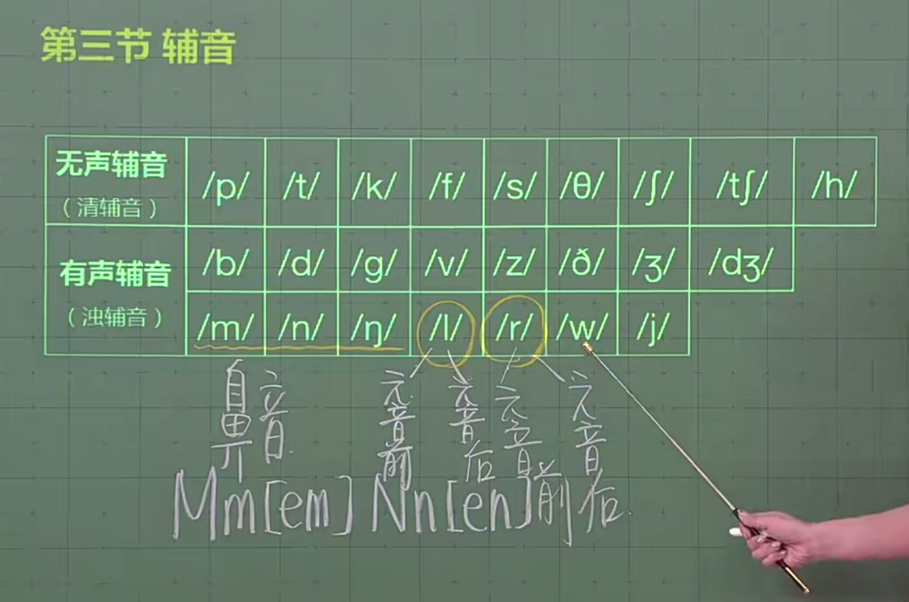

# 辅音

相比于元音，不能单独存在，只能作为辅助音。

清辅音 浊辅音

发音技巧：嘴型保持一直，浊辅音把声音送出来。

## /m/.../n/.../ŋ/

<table>
    <tr>
        <th rowspan="2">单词</th>
        <th colspan="2">发音</th>
    </tr>
    <tr>
        <th>英式</th>
        <th>美式</th>
    </tr>
    <tr>
        <td>sum 金额</td>
        <td>uk /sʌm/</td>
        <td>us /sʌm/</td>
    </tr>
    <tr>
        <td>sun 太阳</td>
        <td>uk /sʌn/</td>
        <td>us /sʌn/</td>
    </tr>
    <tr>
        <td>sung 唱歌</td>
        <td>uk /sʌŋ/</td>
        <td>us /sʌŋ/</td>
    </tr>
    <tr><td colspan="3"></td></tr>
    <tr>
        <td>rum 朗姆酒</td>
        <td>uk /rʌm/</td>
        <td>us /rʌm/</td>
    </tr>
    <tr>
        <td>run 跑，奔跑</td>
        <td>uk /rʌn/</td>
        <td>us /rʌn/</td>
    </tr>
    <tr>
        <td>rung 铃响</td>
        <td>uk /rʌŋ/</td>
        <td>us /rʌŋ/</td>
    </tr>
    <tr><td colspan="3"></td></tr>
    <tr>
        <td>bum 臀部</td>
        <td>uk /bʌm/</td>
        <td>us /bʌm/</td>
    </tr>
    <tr>
        <td>bun 小圆面包</td>
        <td>uk /bʌn/</td>
        <td>us /bʌn/</td>
    </tr>
    <tr>
        <td>bung 塞子</td>
        <td>uk /bʌŋ/</td>
        <td>us /bʌŋ/</td>
    </tr>
</table>

## /l/.../r/

## /w/

## /j/
